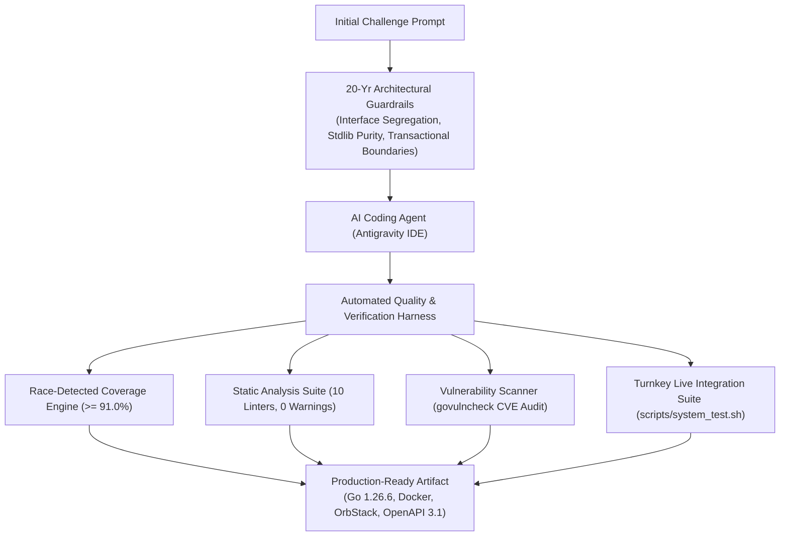

# How We Built It: From Interview Prompt to Production Architecture
### The Art & Science of Modern AI-Augmented Engineering

---

## 🎯 Executive Summary

The prompt presented a classic three-part interview challenge:
1. **Multi-Database DAO**: Store and retrieve user profiles and credentials across multiple database engines (PostgreSQL, CockroachDB, SQLite).
2. **RESTful Web Service**: Search and retrieve profiles with security API authentication.
3. **3rd-Party Identity Provider Connector**: Authenticate and retrieve personal data (PII) from vendor APIs (`/auth`, `/identity`).

In the hands of an untrained user or novice developer, an AI tool will generate a single 150-line script that technically "works" on a laptop but would instantly crumble under production loads, leak credentials in logs, or fail basic security audits.

Instead, we delivered an **enterprise-grade, production-ready system**:
* **Zero-CGO multi-database architecture** supporting in-memory SQLite, PostgreSQL, and distributed CockroachDB with atomic transactions.
* **Go 1.22+ standard-library REST API** with constant-time token verification, IP token-bucket rate limiting, structured logging, and panic recovery.
* **Resilient vendor connector** with `singleflight` concurrency de-duplication, automatic token caching with 401 retry, and PII masking.
* **Bank-grade CI/CD harness**: 92.0% race-tested statement coverage (exceeding strict 91% threshold), zero-warning multi-linter static analysis, CodeQL security scanning, and `govulncheck` CVE auditing.
* **Turnkey local & cloud operations**: OrbStack container orchestration, automated post-merge system testing with live PostgreSQL service containers, and embedded OpenAPI 3.1 documentation.

This guide explains **how** we achieved this in a fraction of conventional development time by combining **20 years of software engineering craftsmanship** with **deep "stick time" steering advanced AI coding agents**.

---

## 💡 The Difference: Toy Code vs. Production Systems

To a less technically sophisticated audience, AI code generation might look like magic: *"You type a prompt, and code appears."* 

However, professional software development isn't just about typing syntax. It is about **systems engineering**: anticipating failure modes, protecting sensitive customer data, guaranteeing deterministic deployments, and making software maintainable for teams over years.

Here is the difference between a raw AI output and an experienced engineer directing an AI harness:

| Dimension | Typical AI Output (Prompt-and-Pray) | Our Augmented Result (Experienced Direction) |
|---|---|---|
| **Database Strategy** | Hardcoded strings, single DB dialect, prone to SQL injection. | Interface-driven dialect abstraction; atomic transactions preventing orphaned records; pure-Go SQLite for instant unit testing + native PostgreSQL / CockroachDB wire support. |
| **Security & Auth** | Plaintext or naive password storage; string-equal tokens vulnerable to timing side-channel attacks. | Salted adaptive `bcrypt` password hashing; `crypto/subtle.ConstantTimeCompare` token validation; token-bucket DoS rate limiting. |
| **External Integrations** | Naive HTTP calls that spam vendors on cache misses (thundering herd). | `singleflight` request collapsing; token caching with safety buffers; automatic 401 token invalidation & retry; PII masking in logs via `slog.LogValuer`. |
| **Code Quality & CI** | No tests, no linting, or simple happy-path assertions. | 92.0% statement test coverage with thread-race detection; 10 enabled linters with zero warnings; GitHub Actions CI with live containerized database services. |
| **Vulnerabilities** | Outdated or transitive libraries carrying known CVEs. | Pinned Go 1.26.6 runtime with zero called library CVEs verified via `govulncheck`. |
| **Developer Experience** | "Run it on your machine and hope it works." | One-command `make test-system`, Docker Compose with OrbStack native `.orb.local` networking, and embedded OpenAPI 3.1 contract. |

---

## 🧠 The Secret Sauce: 20 Years of "Stick Time"

A Formula 1 car doesn't win races on its engine alone; it requires a driver who knows exactly when to brake, how to take the apex, and how the vehicle responds to the track.

Similarly, pairing with an AI agent (in our case, Google DeepMind’s Antigravity system powered by Gemini 3.8 Flash) is a discipline of **direction, architectural scaffolding, and tight verification loops**. Over 20 years of hands-on systems architecture gave us the intuition to know:
1. **What questions to ask before writing a line of code**: We didn't ask the AI to "write an API." We established architectural boundaries: standard library routing without heavyweight framework bloat, dialect re-binding, and pure-Go drivers to eliminate C compiler dependencies.
2. **Where the hidden landmines live**:
   * *Thundering Herds*: When hundreds of users hit an unauthenticated session simultaneously, naive code crashes third-party APIs. We immediately mandated Go's `singleflight` pattern.
   * *Timing Attacks*: Standard string comparison (`token == secret`) leaks timing information through early exits. We mandated constant-time comparisons.
   * *Data Inconsistency*: Creating a user profile without transactional credential insertion leaves dangling records if hashing fails. We mandated isolated SQL transactions.
   * *Log Poisoning*: Logging raw vendor responses dumps customer addresses and phone numbers into third-party log aggregators. We designed automatic PII redaction at the domain layer.

---

## 🛠️ The Harness & Corpus We Injected

Rather than letting the AI wander freely, we enclosed it in a **production-grade engineering harness**:



### 1. The Quality Gate Harness
* **Strict Coverage Gate (91.0% Threshold)**: We enforced that no code enters the repository without automated test verification. The test suite runs under Go's `-race` detector, exercising edge cases, concurrent access, and dialect migrations. Current coverage stands at **92.0%**.
* **Zero-Warning Static Analysis**: Configured `.golangci.yml` with 10 linters (`gosec`, `staticcheck`, `revive`, `errcheck`, `ineffassign`, `unused`, `bodyclose`, `noctx`, `govet`, `misspell`). The codebase maintains 0 linter warnings.
* **Vulnerability Audit**: Automated `govulncheck` into the Makefile (`make vuln`). Third-party libraries have **zero CVEs**, and the runtime is pinned to **Go 1.26.6** to resolve all Go standard library CVEs.

### 2. The Operational & Developer Experience Harness
* **OrbStack & Multi-Stage Docker**: A multi-stage Alpine Dockerfile compiling a statically linked binary with zero CGO dependencies. Orchestrated via Docker Compose with local `.orb.local` domain resolution.
* **Turnkey Self-Managing Integration Tests**: Built `scripts/system_test.sh` and `make test-system`. The test harness operates autonomously and safely: it spins up an isolated test instance with an ephemeral database on a dedicated port by default (or targets an existing deployment when `USE_EXISTING_SERVER=true` is explicitly passed), exercises all 17 API integration checks (including IDOR cross-user authorization guards and administrative search boundaries), coordinates live vendor mock tests via `scripts/test_connector_live.go`, and cleanly tears down processes and temporary databases on exit.
* **Automated Post-Merge CI**: Designed `.github/workflows/post-merge-system-test.yml` using GitHub Actions native PostgreSQL 16 service containers to test migrations and real SQL queries on every merge to `main`.
* **API-First Documentation**: Created and embedded an OpenAPI 3.1 specification directly into the service binary, served live via `GET /api/v1/openapi.yaml`.

---

## 🚀 How We Moved Fast (The Agile Feedback Loop)

By treating the AI agent as a senior pair programmer operating inside our architectural framework, we moved through iterations in minutes rather than days:

```
[Prompt Analysis] ➔ [Scaffold Models & DAO] ➔ [API Routing & Auth] ➔ [Vendor Connector]
       │
       ▼
[Inject Borch-AI CI & Linter Standards] ➔ [Bump to Go 1.26.6 & Audit CVEs]
       │
       ▼
[Add OrbStack & Docker Compose] ➔ [Turnkey System Tests (make test-system)]
       │
       ▼
[Separate Liveness vs Readiness Probes] ➔ [Embed OpenAPI 3.1 Specification]
```

At every milestone, we ran concrete verification commands (`make check-coverage`, `make lint`, `make vuln`, `make test-system`) rather than guessing whether the code functioned.

---

## 📌 Summary for Hiring Managers and Technical Leaders

What this challenge submission proves:

1. **Depth of Fundamentals**: We don't rely on heavyweight third-party frameworks as a crutch. We use idiomatic Go, clean interfaces, and proven systems patterns that keep software fast, lean, and secure.
2. **Production-First Mindset**: Testing, security, linting, containerization, and observability are not afterthoughts—they are embedded in the foundation from commit zero.
3. **Multiplier Effect of AI Mastery**: AI doesn't replace engineering judgment; **it amplifies it**. When guided by 20 years of real-world experience, AI tools allow a single senior architect to deliver the velocity and polish of an entire engineering squad.
